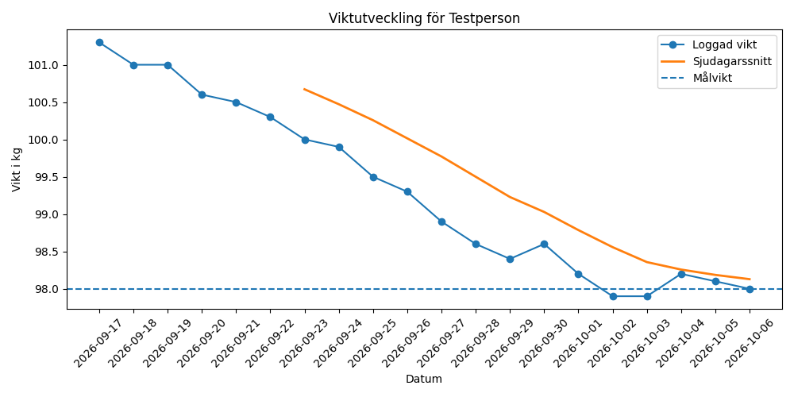

# CutTrack

## Mål

CutTrack är ett verktyg för personer som deffar, alltså bantar med målet att tappa fett men behålla muskelmassa, och som vill följa sin utveckling utan att gissa. Problemet CutTrack löser är att en enskild vägning inte säger något pålitligt: vikten svänger flera hundra gram från dag till dag på grund av vätska och maginnehåll, mer än en hel veckas verkliga fettförlust. Utan ett sätt att skilja brus från trend blir varje dags siffra lika mycket värd som nästa, vilket gör det svårt att veta om dieten faktiskt fungerar.

Programmet löser det genom att låta användaren logga vikt, kalorier, protein, steg, träning och (valfritt) midjemått dagligen, och genom att vänta med att dra slutsatser tills det finns tillräckligt med data. Det räknar ut ett personligt kaloriförslag, bedömer om viktnedgången håller rätt takt, och ger en prioriterad rekommendation utifrån vad som faktiskt avviker mest, vikt, protein, träningsfrekvens eller steg.

Kopplingen till AI-utvecklarrollen ligger inte i att programmet innehåller AI, utan i att det bygger den typ av strukturerad, validerad data som en framtida maskininlärningsmodell skulle behöva för att göra samma bedömning automatiskt. Se avsnittet Analys för ett utvecklat resonemang om det.

## Metod

CutTrack är byggt i en enda Jupyter Notebook, med tre klasser och elva fristående funktioner.

**Klasser och arv:** `DailyLog` representerar en enskild dags logg och validerar vikt och kalorier vid skapandet. `User` är basklassen med en persons grunddata och metoderna som räknar på loggarna (medelvärden, viktförändring, träningsfrekvens). `CutProfile` ärver från `User` med `super().__init__()` och lägger till mål, kaloriberäkningar (Mifflin-St Jeor) och den regelbaserade analysen i `check_goals`.

**Datahantering:** Profilen sparas och läses som JSON (`save_profile`, `load_profile`), med filnamnet byggt säkert från användarnamnet i `make_filename`. Loggarna exporteras och kan läsas in som CSV (`export_logs_csv`, `import_logs_csv`), vilket är den datafil som lämnas in vid examination.

**Felhantering:** try/except används genomgående, bland annat tre skilda except-block i `load_profile` för trasig JSON, saknade fält och ogiltiga värden, samt try/except inne i importloopen i `import_logs_csv` så att en trasig rad i en CSV-fil inte stoppar resten av importen.

**Bibliotek:** Standardbiblioteken `json`, `csv`, `datetime` och `os`. Externa biblioteket `matplotlib` för viktdiagrammet, som visar både daglig vikt och ett rullande sjudagarssnitt.

**Gränssnitt:** En textbaserad meny (`run_menu`) med sex val: logga dagens data, visa analys, visa diagram, visa kaloriförslag, läsa in loggar från CSV, samt spara och avsluta. All inmatning och utskrift hålls i egna funktioner, separat från klasserna, så att logiken går att återanvända om gränssnittet byts ut senare.

## Källor, kaloriberäkningarna

- Mifflin MD, St Jeor ST, Hill LA, Scott BJ, Daugherty SA, Koh YO. *A new predictive equation for resting energy expenditure in healthy individuals.* Am J Clin Nutr. 1990;51(2):241-247. https://pubmed.ncbi.nlm.nih.gov/2305711/
- Wishnofsky M. *Caloric equivalents of gained or lost weight.* Am J Clin Nutr. 1958;6(5):542-546. https://pubmed.ncbi.nlm.nih.gov/13594881/
- Hall KD, Sacks G, Chandramohan D, Chow CC, Wang YC, Gortmaker SL, Swinburn BA. *Quantification of the effect of energy imbalance on bodyweight.* Lancet. 2011;378(9793):826-837. https://pubmed.ncbi.nlm.nih.gov/21872751/
- Garthe I, Raastad T, Refsnes PE, Koivisto A, Sundgot-Borgen J. *Effect of two different weight-loss rates on body composition and strength and power-related performance in elite athletes.* Int J Sport Nutr Exerc Metab. 2011;21(2):97-104. https://pubmed.ncbi.nlm.nih.gov/21558571/
- Helms ER, Aragon AA, Fitschen PJ. *Evidence-based recommendations for natural bodybuilding contest preparation: nutrition and supplementation.* J Int Soc Sports Nutr. 2014;11:20. https://www.ncbi.nlm.nih.gov/pmc/articles/PMC4033492/
- Morton RW, Murphy KT, McKellar SR, m.fl. *A systematic review, meta-analysis and meta-regression of the effect of protein supplementation on resistance training-induced gains in muscle mass and strength in healthy adults.* Br J Sports Med. 2018;52(6):376-384. https://pmc.ncbi.nlm.nih.gov/articles/PMC5867436/

**Basalomsättning (calculate_bmr)** räknas enligt Mifflin-St Jeor.

**Kalorigolvet i suggest_calorie_goal** bygger på tumregeln 7700 kcal per kilo kroppsfett, ursprungligen Wishnofsky 1958. Regeln antar ett konstant energiunderskott, vilket inte stämmer: förbrukningen sjunker i takt med vikten, vilket gör att regeln överskattar den faktiska viktnedgången över tid. Hall m.fl. 2011 visar det med en dynamisk modell. CutTrack använder 7700-regeln medvetet som en enkel startpunkt, inte för att den är exakt.

**Säkerhetstaket på 1,0 procent per vecka i check_goals** utgår från Garthe m.fl. 2011, som jämförde 0,7 mot 1,4 procent viktnedgång per vecka hos idrottare. Gruppen på 0,7 procent ökade fettfri massa, gruppen på 1,4 procent gjorde det inte. CutTracks tak på 1,0 procent ligger mellan de två, som en säkerhetsmarginal snarare än en exakt återgivning av studiens resultat.

**Proteinmålet (1,9 g per kilo målvikt)** utgår inte direkt från Helms m.fl. 2014, som rekommenderar 2,3 till 3,1 g per kilo fettfri massa för tävlande bodybuildare under tävlingsförberedelse. CutTrack loggar ingen kroppsfettsprocent och kan därför inte räkna på fettfri massa. 1,9 g/kg kroppsvikt ligger i stället i linje med Morton m.fl. 2018, vars metaanalys visar att nyttan för muskelbevarande planar ut runt 1,6 g/kg kroppsvikt med en praktisk övre gräns kring 2,2, ett intervall som passar bättre för en icke-tävlande användare.

## Resultat

Nedan visas CutTracks utskrifter från en testperiod på 20 dagar, med en profil och datamängd konstruerad för att spegla min egen verkliga rutin (längd 189 cm, ålder 39, startvikt 101,5 kg, målvikt 98 kg, kalorier, proteinintervall, stegintervall och träningsfrekvens), men där siffrorna är simulerade och inte en logg förd dag för dag.

**Efter 14 dagar, första gången full analys är möjlig:**
```
Vikten: minskar med 1.31 procent per vecka (cirka 1.3 kg), över säkerhetsgränsen 1,0 procent (cirka 1.0 kg för dig). Risk för muskelförlust.
Protein: snitt 211 g mot mål 206 g. Målet nås.
Träning: 5 av 5 planerade dagar den senaste veckan. Målet nås.
Steg: snitt 10160 mot mål 10000. Målet nås.

Fokusera på: vikt.
```

**Efter 18 dagar, takten har hunnit sakta in:**
```
Vikten: minskar med 0.41 procent per vecka (cirka 0.4 kg), långsammare än ditt mål på 0.6 procent (cirka 0.6 kg för dig).
```

**Efter 20 dagar, vikten har hittat rätt takt och är nära målvikten, stegen har istället blivit det som avviker:**
```
Vikten: minskar med 0.61 procent per vecka (cirka 0.6 kg), vid eller över ditt mål på 0.6 procent och inom säkerhetsgränsen.
Protein: snitt 213 g mot mål 206 g. Målet nås.
Träning: 5 av 5 planerade dagar den senaste veckan. Målet nås.
Steg: snitt 9953 mot mål 10000. Under målet.

Fokusera på: steg.
```

Programmets kaloriförslag för samma profil blev 2409 kcal per dag. Det faktiska intaget i datan låg på 2300 kcal, något under förslaget, vilket är en bidragande orsak till att takten periodvis låg över säkerhetsgränsen tidigt i perioden.

Midjemåttet minskade från 90,0 till 88,2 cm under perioden, vilket enligt produktvisionens resonemang stärker bilden av att det är fett snarare än muskelmassa som gått ner.



## Analys – yrkesroller, verksamheter och trender

CutTrack löser i grunden ett dataproblem. Enskilda vägningar påverkas av exempelvis vätska och ger därför begränsad information. Programmet samlar i stället in data konsekvent, kontrollerar att värdena är rimliga, lagrar dem strukturerat och analyserar utvecklingen över tid. Genom att använda tydliga datatyper och skilja saknade värden från nollor minskar risken för missvisande resultat.

Detta motsvarar de första stegen i ett dataflöde inom AI och maskininlärning. CutTrack är i nuläget regelbaserat: jag bestämmer exempelvis hur ett veckosnitt beräknas och att viktnedgången inte bör överstiga 1,0 procent per vecka. En framtida ML-modell skulle i stället kunna tränas på historiska data för att identifiera samband mellan vikt, kaloriintag, protein och träningsfrekvens. Det skulle dock kräva betydligt fler observationer, relevanta variabler och testdata för att resultatet skulle bli tillförlitligt.

Projektet berör flera yrkesroller inom AI- och dataområdet. En data engineer arbetar med insamling, lagring och kvalitetssäkring av data. En data scientist analyserar information och utvecklar modeller, medan en AI- eller ML-engineer tränar, utvärderar och driftsätter dem. Systemutvecklare integrerar sedan funktionerna i en användbar tjänst. I CutTrack arbetar jag främst med delar som är gemensamma för data engineering och systemutveckling: datainsamling, validering, lagring och regelbaserad analys.

Liknande dataflöden används inom healthtech, träningsappar och andra datadrivna verksamheter. Om CutTrack utvecklades till en kommersiell AI-tjänst skulle även integritet, informationssäkerhet, samtycke och ansvarsfull hantering av personuppgifter behöva ingå.

Behovet av denna kompetens ökar. Enligt SCB använde 35 procent av svenska företag med minst tio anställda AI under 2025, jämfört med cirka 25 procent 2024. Sverige låg därmed över EU-genomsnittet på omkring 20 procent. AI-användningen var samtidigt betydligt högre bland stora företag, vilket tyder på att tillgång till resurser, kompetens och fungerande datahantering har betydelse för möjligheten att införa AI.

CutTrack innehåller ännu ingen AI-modell, men projektet visar en central del av AI-utvecklarens arbete: att omvandla rå information till tillförlitlig och återanvändbar data som kan ligga till grund för analys, beslutsstöd och framtida maskininlärning.

**Källor**
- SCB – It-användning i företag 2025
- SCB – Artificiell intelligens i Sverige 2025

## Certifikat

Ett naturligt första certifikat efter den här kursen är **AI-901, Microsoft Azure AI Fundamentals**. Det är Microsofts nybörjarcertifiering för AI på Azure, ingen förkunskap krävs. Notera att AI-901 ersatte det tidigare AI-900 den 30 juni 2026, det gamla provet går inte längre att boka. Skillnaden är att AI-901 lutar mer åt praktisk implementation, med Python, REST-API:er, SDK:er och Microsoft Foundry, jämfört med AI-900 som mest var konceptuellt. Det passar bra ihop med den här kursen, eftersom AI-901 faktiskt förutsätter grundläggande Python-kunskap, vilket den här kursen ger. Kostnad omkring 99 USD, prissatt per land.

Ett rimligt nästa steg efter det är **AI-103, Azure AI Apps and Agents Developer Associate**, som ersatte det tidigare AI-102 samma datum. Den kräver mer utvecklingserfarenhet och fokuserar på att bygga AI-appar och agenter i Azure, snarare än bara att beskriva vad tjänsterna gör. Kostnad omkring 165 USD.

Ingen av de här är tagen ännu, det här är en kort redogörelse för vad som är relevant, inte en bekräftelse på avklarad certifiering.

## Reflektion

Det jag uppskattade mest var arbetssättet. Jag planerade och skissade lösningen innan jag började skriva kod, byggde en del i taget och testade varje funktion innan jag gick vidare. Det gjorde projektet lättare att förstå och minskade risken för att fel skulle följa med till senare delar. Jag fick också bättre kontroll över koden än om jag hade försökt bygga hela notebooken på en gång.

Den största tekniska utmaningen var metoden `get_logs` i klassen `User`. Metoden väljer vilka loggar som ska ingå i ett genomsnitt eller en trend utifrån kalenderdagar räknade bakåt från det senast registrerade datumet. Den hämtar alltså inte bara de senaste raderna i listan. Det är viktigt eftersom användaren kan ha missat att registrera vissa dagar. Samma metod används sedan av beräkningar för bland annat medelvikt, viktförändring och träningsfrekvens. När jag förstod `get_logs` blev därför även resten av `User`-klassen lättare att följa. Jag såg också fördelen med att samla filtreringen på ett ställe i stället för att upprepa samma logik i flera metoder.

Om jag gjorde om projektet skulle jag bestämma fil- och mappstrukturen redan från början. Under arbetet skapades dubbla mappar och vissa filer hamnade både i docs och i projektroten. Det kostade en hel kväll att reda ut och gjorde det svårare att veta vilken version som var aktuell. Nästa gång skulle jag tidigt skilja på exempelvis kod, data, dokumentation och tester. Den viktigaste lärdomen är därför att en tydlig struktur runt koden är lika viktig som att själva koden fungerar.

## GitHub

https://github.com/NiklasEkeskar/CutTrack

## Installation

1. Klona repot: `git clone https://github.com/NiklasEkeskar/CutTrack.git`
2. Öppna mappen i VS Code eller Jupyter.
3. Skapa och aktivera en virtuell miljö (rekommenderas):
   ```
   python -m venv .venv
   ```
   Aktivera den enligt din plattform, i VS Code väljs den automatiskt som kernel.
4. Installera det externa biblioteket:
   ```
   python -m pip install matplotlib
   ```
5. Öppna `cuttrack.ipynb` och kör cellerna i ordning, uppifrån och ner (eller Run All).
6. Den sista cellen startar menyn och väntar på inmatning i notebooken.

## AI-användning

Jag har använt Claude som bollplank och studiecoach genom hela projektet. Idén, produktvisionen och de bärande besluten är mina. AI:n har bidragit med förslag och invändningar, men riktlinjerna för hur programmet skulle utformas har vi arbetat fram gemensamt utifrån mina beslut.

Konkret har AI:n skrivit kodförslag som jag gått igenom, testat och lagt in i notebooken, förklarat koncept som varit nya för mig, och ifrågasatt mina val när de haft brister.

Under arbetets gång har vi gått igenom koden funktion för funktion, där jag förklarat vad varje del gör och varför den är skriven som den är. Det som återstod att förstå har vi repeterat tills det satt.
