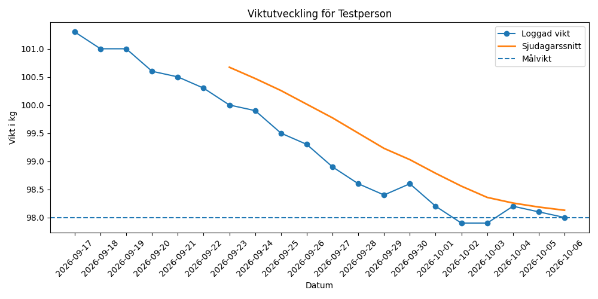
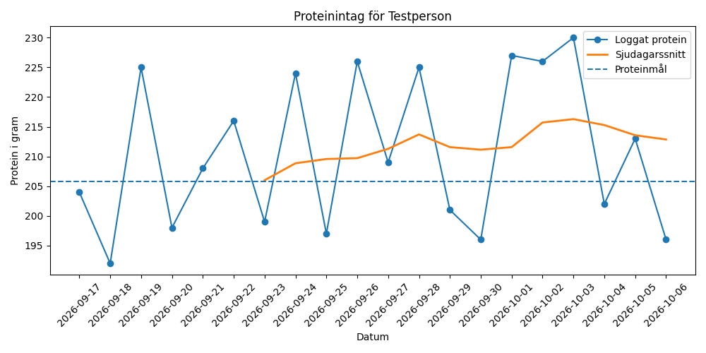
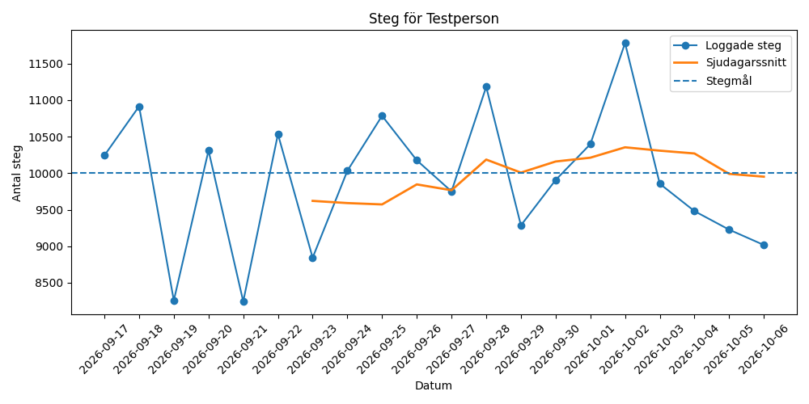
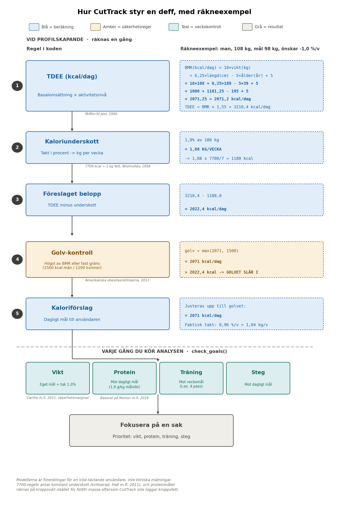

# CutTrack

Ett verktyg för dig som deffar. Du loggar vikt, kalorier, protein, steg och träning varje dag, och CutTrack visar om utvecklingen går åt rätt håll. Programmet väntar med att dra slutsatser tills det finns underlag, eftersom en enskild vägning mest är brus.



Status: version 1 fungerar och byggs vidare. Gränssnittet är en textmeny som körs i en Jupyter Notebook. Skrivet i Python, med matplotlib för diagram.

## Varför CutTrack finns

Den som deffar vill tappa fett men behålla muskelmassan. Problemet är att en enskild vägning inte säger något pålitligt: vikten svänger flera hundra gram från dag till dag på grund av vätska och maginnehåll, mer än en hel veckas verkliga fettförlust. Utan ett sätt att skilja brus från trend blir varje dags siffra lika mycket värd som nästa, och det är svårt att veta om dieten fungerar.

Jag har löst det här manuellt, med klipp och klistra och skärmdumpar. Det fungerar för mig men går inte att ge vidare till någon annan. CutTrack gör samma sak i ett program där varje person har sin egen profil och sina egna loggar.

Projektet började som slutprojekt i kursen Utveckling med Python, grund, inom YH-utbildningen AI Developer på Jensen Education, och byggs nu vidare som ett eget projekt.

## Vad programmet gör

- Varje användare har en egen profil med längd, ålder, kön, aktivitetsnivå, startvikt, målvikt och önskad takt. Profilen sparas som JSON.
- Dagliga loggar med datum, vikt, kalorier, protein, steg, träning (ja eller nej) och midjemått (valfritt). En ny logg för ett datum som redan finns ersätter den gamla.
- Ett personligt kaloriförslag beräknat från profilen, med ett golv som programmet förklarar när det slår i.
- Analys över 7, 14 eller 30 dagar: viktens takt i procent per vecka, protein, träningsfrekvens och steg, plus en sak att fokusera på.
- Diagram för vikt (med rullande sjudagarssnitt och målvikt), protein och steg. Menyn visar än så länge bara viktdiagrammet.
- Export och import av loggar som CSV. En trasig rad i en CSV-fil hoppas över i stället för att stoppa hela importen.

## Så bedömer CutTrack din deff

| Område | Så bedöms det |
| --- | --- |
| Vikt | Takten räknas som procent av kroppsvikten per vecka. Går det långsammare än ditt eget mål flaggas det. Går det över 1,0 procent per vecka flaggas det alltid, oavsett ditt mål, eftersom risken för muskelförlust ökar. Ökar vikten flaggas det också. |
| Protein | Dagligt snitt mot ett mål på 1,9 gram per kilo målvikt. |
| Träning | Antal träningsdagar mot ditt mål, standard tre per vecka, omräknat till vald period. |
| Steg | Dagligt snitt mot ditt stegmål, standard 8 000. |
| Prioritering | Alla fyra områden visas, sedan lyfts en sak fram att fokusera på: vikt först, därefter protein, träning och steg. |

Av målen frågar menyn bara efter målvikt och takt. Standardvärdena för protein, steg och träning ligger i koden och kan ändras i profilens JSON-fil.

Programmet väntar med bedömningen. En vald period (7, 14 eller 30 dagar) krävs för att visa ett snitt och två perioder för att bedöma takten, eftersom den andra perioden visar om snittet faktiskt rör sig. Med sjudagarsperiod börjar full analys på dag 14, med 14 dagars period på dag 28 och med 30 dagar på dag 60. Under väntetiden skriver programmet en förklaring och hur många dagar som återstår.

## Exempel

Exemplet kommer från en testperiod på 20 dagar med profilen Testperson: man, 189 cm, 39 år, startvikt 101,5 kg, målvikt 98 kg, önskad takt 0,6 procent per vecka, proteinmål 2,1 gram per kilo målvikt, stegmål 10 000 och fem träningsdagar i veckan. Loggarna är simulerade, inte en logg förd dag för dag. Utskrifterna visar analysen över de senaste sju dagarna.

**Efter 14 dagar, första gången full analys är möjlig:**
```
Vikten: minskar med 1.31 procent per vecka (cirka 1.3 kg), över säkerhetsgränsen 1,0 procent (cirka 1.0 kg för dig). Risk för muskelförlust.
Protein: snitt 211 g mot mål 206 g. Målet nås.
Träning: 5 av 5 förväntade dagar under perioden. Målet nås.
Steg: snitt 10160 mot mål 10000. Målet nås.

Fokusera på: vikt.
```

**Efter 18 dagar (bara viktraden visas här):**
```
Vikten: minskar med 0.41 procent per vecka (cirka 0.4 kg), långsammare än ditt mål på 0.6 procent (cirka 0.6 kg för dig).
```

**Efter 20 dagar:**
```
Vikten: minskar med 0.61 procent per vecka (cirka 0.6 kg), vid eller över ditt mål på 0.6 procent och inom säkerhetsgränsen.
Protein: snitt 213 g mot mål 206 g. Målet nås.
Träning: 5 av 5 förväntade dagar under perioden. Målet nås.
Steg: snitt 9953 mot mål 10000. Under målet.

Fokusera på: steg.
```

Takten byter besked mellan utskrifterna (1,31, 0,41 och 0,61 procent per vecka) trots att veckosnittet för vikten sjunker hela tiden (99,03, 98,26 och 98,13 kg vid de tre tillfällena). Det beror på att takten i version 1 räknas från första och sista vägningen i perioden, och därför följer enskilda dagars svängningar. Det är just den sortens brus CutTrack ska skydda mot, så metoden ska bytas (se Begränsningar och Roadmap). Utskrifterna visar vad programmet faktiskt skriver ut, inte vad som är sant om testpersonens utveckling.

Programmets kaloriförslag för samma profil blev 2409 kcal per dag. Det faktiska intaget i datan låg på 2300 kcal, något under förslaget, vilket är en bidragande orsak till att takten låg över säkerhetsgränsen tidigt i perioden.

Midjemåttet loggades tre gånger och sjönk från 90,0 till 88,2 cm. CutTrack sparar det men analyserar det inte än (se Roadmap). Läst för hand pekar en sjunkande midja tillsammans med sjunkande vikt mot att det är fett som försvinner, resonemanget finns i [docs/produktvision.md](docs/produktvision.md).

Diagrammen från samma testperiod: viktdiagrammet står överst på sidan, protein och steg följer här.





## Kom igång

1. Klona repot och gå in i mappen:
   ```
   git clone https://github.com/NiklasEkeskar/CutTrack.git
   cd CutTrack
   ```
2. Skapa och aktivera en virtuell miljö (rekommenderas):
   ```
   python -m venv .venv
   source .venv/bin/activate
   ```
   På Windows PowerShell aktiveras den med `.venv\Scripts\Activate.ps1`.
3. Installera matplotlib:
   ```
   python -m pip install matplotlib
   ```
   Senaste matplotlib (3.11) kräver Python 3.11 eller senare, äldre Python får en äldre version via pip.
4. Öppna `cuttrack.ipynb` i VS Code (med tillägget Jupyter) eller i Jupyter, välj den virtuella miljön som kernel och kör cellerna uppifrån och ner. Den sista cellen startar menyn och väntar på inmatning.

Ändrar du något i `models.py` eller `analysis.py` medan notebooken är öppen måste kerneln startas om (Restart), eftersom Python bara läser in en modul en gång per körning.

Profilen sparas som `<namn>.json` i mappen du kör från och ignoreras av git. Val 6 i menyn exporterar dessutom loggarna till `cuttrack_loggar.csv` i samma mapp, och notebookens exempelcell skriver samma fil med den simulerade exempeldatan. Filen finns inte i repot, men den är undantagen från `.gitignore`, så den syns som en ny fil i git så fort programmet har körts. En export med riktiga loggar kan därför committas av misstag: lägg till filer med namn (till exempel `git add README.md`) i stället för `git add .`, och committa aldrig filen om den innehåller riktig data. Att skilja exempeldata från användarens egna loggar står först i Roadmap.

## Projektstruktur

```
CutTrack/
  models.py             DailyLog, User och CutProfile (data och regler)
  analysis.py           filhantering (JSON, CSV) och diagram
  cuttrack.ipynb        menyn, förklaringar och exempelkörning
  docs/                 produktvision, kravspec, teknisk plan, statuslogg
  README.md
  *.png                 bilder till README
```

## Hur det är byggt

**Klasser och arv.** `DailyLog` är en dags logg och validerar vikt och kalorier när objektet skapas. `User` är basklassen med personens grunddata och metoderna som räknar på loggarna. `CutProfile` ärver från `User` med `super().__init__()` och lägger till mål, kaloriberäkning (Mifflin-St Jeor) och regelanalysen i `check_goals`. Att deffa är ett läge bland flera möjliga, så arvet gör det möjligt att lägga till andra lägen utan att ändra `User`.

**Kalenderdagar, inte antal loggar.** Fönstret för ett snitt räknas i kalenderdagar bakåt från det senast loggade datumet, inte som de senaste raderna i listan. Annars skulle sju loggar utspridda över en månad räknas som ett veckosnitt. Urvalet ligger i `get_logs`, som alla snitt använder, så regeln finns på ett enda ställe.

**Saknade värden.** `None` betyder att ett värde saknas, 0 betyder att det mättes till noll. Ett midjemått som inte mätts är `None`, och kontrollen görs med `is not None` eftersom 0 och `None` annars behandlas lika i ett vanligt if-test.

**Validering i klassen.** `DailyLog` och `CutProfile` kastar `ValueError` vid orimliga värden, så kontrollen gäller oavsett om objektet skapas av inmatning, CSV-import eller en JSON-fil.

**Felhantering.** `load_profile` har tre separata except-block (trasig JSON, saknat fält, ogiltigt värde) eftersom felen betyder olika saker för användaren. `import_logs_csv` har try/except inne i loopen så att en trasig rad hoppas över i stället för att stoppa importen. Skrivfel fångas med `OSError`.

**Säkra filnamn.** Filnamnet byggs aldrig direkt av det användaren skriver. `make_filename` behåller bara a till z och siffror, så ett namn som `../../etc/passwd` inte kan styra var filen hamnar.

**Gränssnittet är separat från logiken.** All inmatning och utskrift ligger i egna funktioner, skilda från klasserna, så att menyn kan bytas mot ett annat gränssnitt utan att röra beräkningarna.

**Kaloriberäkningen visuellt.** Diagrammet nedan visar hela kedjan i `suggest_calorie_goal` och `check_goals`, från TDEE till det slutliga kaloriförslaget, med ett fristående räkneexempel (inte samma profil som i exemplet ovan). Det är en illustration som förklarar golvlogiken, inte en skärmdump från CutTrack.



## Källor och antaganden

- Mifflin MD, St Jeor ST, Hill LA, Scott BJ, Daugherty SA, Koh YO. *A new predictive equation for resting energy expenditure in healthy individuals.* Am J Clin Nutr. 1990;51(2):241-247. https://pubmed.ncbi.nlm.nih.gov/2305711/
- Wishnofsky M. *Caloric equivalents of gained or lost weight.* Am J Clin Nutr. 1958;6(5):542-546. https://pubmed.ncbi.nlm.nih.gov/13594881/
- Hall KD, Sacks G, Chandramohan D, Chow CC, Wang YC, Gortmaker SL, Swinburn BA. *Quantification of the effect of energy imbalance on bodyweight.* Lancet. 2011;378(9793):826-837. https://pubmed.ncbi.nlm.nih.gov/21872751/
- Garthe I, Raastad T, Refsnes PE, Koivisto A, Sundgot-Borgen J. *Effect of two different weight-loss rates on body composition and strength and power-related performance in elite athletes.* Int J Sport Nutr Exerc Metab. 2011;21(2):97-104. https://pubmed.ncbi.nlm.nih.gov/21558571/
- Helms ER, Aragon AA, Fitschen PJ. *Evidence-based recommendations for natural bodybuilding contest preparation: nutrition and supplementation.* J Int Soc Sports Nutr. 2014;11:20. https://www.ncbi.nlm.nih.gov/pmc/articles/PMC4033492/
- Morton RW, Murphy KT, McKellar SR, m.fl. *A systematic review, meta-analysis and meta-regression of the effect of protein supplementation on resistance training-induced gains in muscle mass and strength in healthy adults.* Br J Sports Med. 2018;52(6):376-384. https://pmc.ncbi.nlm.nih.gov/articles/PMC5867436/
- Jensen MD m.fl. *2013 AHA/ACC/TOS Guideline for the Management of Overweight and Obesity in Adults.* Circulation. 2014;129(25 Suppl 2). https://doi.org/10.1161/01.cir.0000437739.71477.ee

**Basalomsättning (`calculate_bmr`)** räknas enligt Mifflin-St Jeor.

**Underskottet i `suggest_calorie_goal`** bygger på tumregeln 7700 kcal per kilo kroppsfett, ursprungligen Wishnofsky 1958. Regeln antar ett konstant energiunderskott, vilket inte stämmer: förbrukningen sjunker i takt med vikten, vilket gör att regeln överskattar den faktiska viktnedgången över tid. Hall m.fl. 2011 visar det med en dynamisk modell. CutTrack använder 7700-regeln medvetet som en enkel startpunkt, inte för att den är exakt.

**Kalorigolvet** är det högsta av en fast gräns och personens egen basalomsättning. De fasta gränserna, 1 200 kcal för kvinnor och 1 500 kcal för män, är nedre kanten i riktlinjerna för behandling av övervikt och fetma hos vuxna (Jensen m.fl. 2013), som rekommenderar 1 200 till 1 500 kcal per dag för kvinnor och 1 500 till 1 800 för män, vanligen justerat efter kroppsvikt. Riktlinjerna gäller personer med övervikt eller fetma, CutTrack använder dem som golv för alla användare, vilket är en förenkling. Basalomsättningen läggs till eftersom ett förslag under vad kroppen gör av med i vila är svårt att motivera, och för att golvet då följer personen i stället för ett fast tal. Slår golvet i justerar programmet aldrig tyst: det säger vad som hände, vilket golv som gällde och vilken takt användaren faktiskt får.

**Säkerhetstaket på 1,0 procent per vecka i `check_goals`** utgår från Garthe m.fl. 2011, som jämförde 0,7 mot 1,4 procent viktnedgång per vecka hos idrottare. Gruppen på 0,7 procent ökade fettfri massa, gruppen på 1,4 procent gjorde det inte. CutTracks tak på 1,0 procent ligger mellan de två, som en säkerhetsmarginal snarare än en exakt återgivning av studiens resultat.

**Proteinmålet (1,9 g per kilo målvikt)** utgår inte direkt från Helms m.fl. 2014, som rekommenderar 2,3 till 3,1 g per kilo fettfri massa för tävlande bodybuildare under tävlingsförberedelse. CutTrack loggar ingen kroppsfettsprocent och kan därför inte räkna på fettfri massa. 1,9 g/kg kroppsvikt ligger i stället i linje med Morton m.fl. 2018, vars metaanalys visar att nyttan för muskelbevarande planar ut runt 1,6 g/kg kroppsvikt med en praktisk övre gräns kring 2,2, ett intervall som passar bättre för en icke-tävlande användare.

## Begränsningar

- Vikttakten räknas från första och sista vägningen i perioden, inte på snitt. En enskild vägning flyttar därför resultatet märkbart: i exemplet ger 200 gram mer eller mindre på sista vägningen 1,11 respektive 1,52 procent per vecka i stället för 1,31. Divisionen sker dessutom på periodens längd i stället för på antalet dagar mellan första och sista vägningen, vilket ger en takt som är ungefär 14 procent för låg på sjudagarsperioden. Metoden ska bytas mot en jämförelse mellan snittet för senaste perioden och snittet för perioden före.
- Kaloriförslaget är en uppskattning. 7700-regeln överskattar viktnedgången över tid, så siffran ska justeras efter verkligt utfall efter ett par veckors loggning.
- Proteinmålet räknas på målvikt eftersom programmet inte känner till kroppsfett.
- Under väntetiden visar programmet bara en förklaring. Protein, steg och träning analyseras inte förrän perioden är full, och snittet visas inte under dag 7 till 13.
- Midjemåttet sparas men används inte i någon analys än.
- Vald period styr väntetiden: med 30 dagar krävs 60 dagars data innan takten bedöms.
- Menyn är en notebookcell, inte ett fristående program, och visar bara viktdiagrammet.
- Det finns inga automatiska tester än. Koden är testad för hand med exempeldata, simulerad inmatning och trasiga JSON- och CSV-filer.
- Exempeldatan är simulerad.

## Ansvarsfriskrivning

CutTrack ger allmänna riktvärden baserade på etablerade rekommendationer. Det är inte medicinsk rådgivning. Rådgör med läkare eller dietist vid sjukdom, graviditet eller medicinering.

## Vad jag lärde mig

**Bygg en del i taget och testa innan nästa.** Jag planerade och skissade lösningen innan jag skrev kod, byggde en del i taget och testade varje funktion innan jag gick vidare. Det gjorde koden lättare att förstå och minskade risken att fel följde med till senare delar.

**`get_logs` var det svåraste.** Metoden väljer vilka loggar som ingår i ett snitt eller en trend utifrån kalenderdagar räknade bakåt från det senast loggade datumet. Den hämtar alltså inte bara de senaste raderna i listan, vilket spelar roll eftersom användaren kan ha missat att logga vissa dagar. Samma metod används för medelvikt, viktförändring och träningsfrekvens, så när jag förstod `get_logs` blev resten av `User`-klassen lättare att följa. Jag såg också fördelen med att samla urvalet på ett ställe i stället för att upprepa logiken i flera metoder.

**Bestäm strukturen tidigt.** Under arbetet skapades dubbla mappar och filer hamnade både i docs och i projektroten. Det kostade en hel kväll att reda ut och gjorde det svårare att veta vilken version som var aktuell. Den viktigaste lärdomen är att en tydlig struktur runt koden är lika viktig som att själva koden fungerar.

**Regler först, maskininlärning senare.** CutTrack är regelbaserat med avsikt: jag har bestämt sjudagarsfönstret, säkerhetstaket på 1,0 procent per vecka och hur proteinmålet räknas, och `check_goals` jämför mot de gränserna. En framtida modell skulle kunna tränas på historiska data för att hitta samband mellan vikt, kalorier, protein och träning, men det kräver betydligt fler observationer och mer testdata än ett enskilt projekt har. Klasserna, valideringen, filhanteringen och datainsamlingen skulle kunna återanvändas. Det som skulle behövas är dataförberedelse, träning och utvärdering av modellen, och en `check_goals` som baserar sin återkoppling på modellens förutsägelse i stället för på mina fasta regler. En modell kan inte ge tillförlitliga bedömningar utan tillräcklig och välstrukturerad data, och det är den delen CutTrack bygger.

## Roadmap

Nästa steg, i den ordning jag tänker ta dem. Detaljer finns i [docs/produktvision.md](docs/produktvision.md) och [docs/statuslogg.md](docs/statuslogg.md).

1. **Grund.** Automatiska tester för reglerna (golv, takt, fönster, väntetid) och för filhanteringen (profilfiler, CSV-inläsning), en körbar `main.py` så att programmet startar utan Jupyter, en `requirements.txt`, och en tydlig skillnad mellan exempeldata och användarens egna loggar.
2. **Rätta vikttakten och bygg det visionen redan beskriver.** Takten räknas på snitt mot föregående snitt i stället för på första och sista vägningen. Därefter analys av protein, steg och träning redan under väntetiden, snittet under dag 7 till 13, friskrivningen även vid kaloriförslaget, protein- och stegdiagram i menyn och sist midjemått jämfört med vikt.
3. **Mer räkning på redan loggad data.** Dagar till målvikt (linjär projektion av aktuell takt), platådetektion (vikten har stått still trots rätt underskott), midjemått mot vikt över hela perioden, och korrelation mellan protein, steg, träning och viktförändring.
4. **Fler lägen.** Viktbalans och muskelbygge som nya barnklasser till `User`, samt en coachroll som kan läsa en användares analys utan att kunna ändra loggarna.
5. **Mer datainsamling och andra gränssnitt.** Automatisk inläsning av steg från telefon eller klocka, ett webbgränssnitt ovanpå samma klasser, veckorapporter och koppling till hälso- och träningsappar.

## AI-användning

Jag har använt Claude (Anthropic) som bollplank och kodassistent genom hela projektet. Idén, produktvisionen och de bärande besluten är mina. Stora delar av koden har skrivits av Claude utifrån mina beslut och krav, och jag har gått igenom, testat och lagt in den själv. Claude har också förklarat koncept som var nya för mig och ifrågasatt mina val när de haft brister. Jag har gått igenom koden funktion för funktion och kan förklara vad varje del gör och varför den är skriven som den är.
